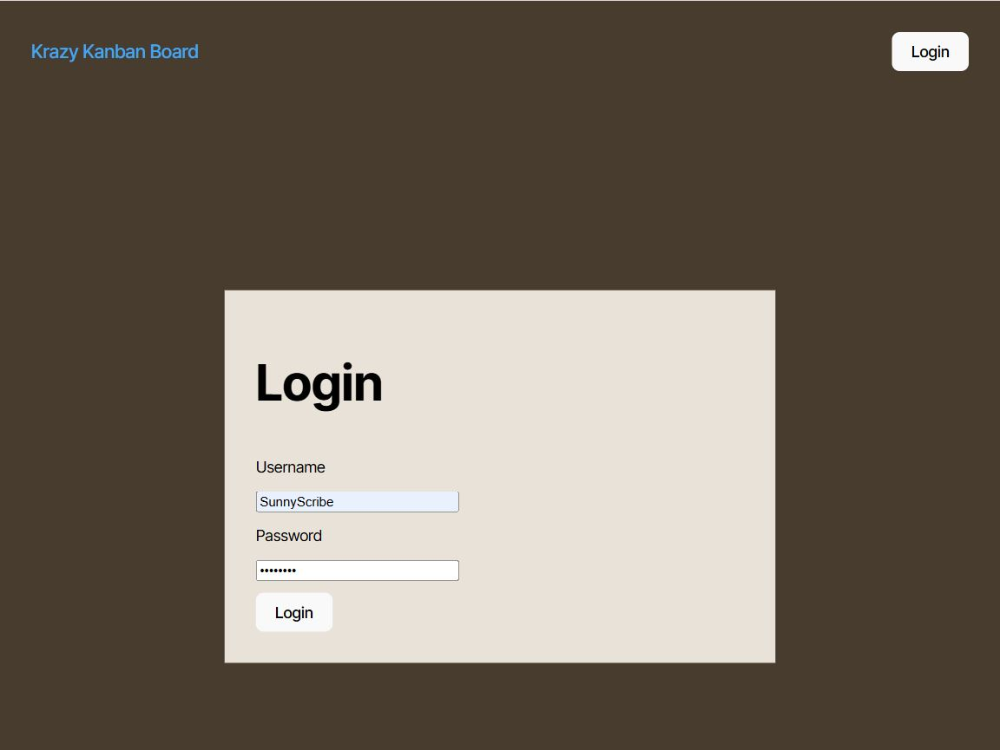

# In Your Lane 

## Description

A Kanban board application featuring secure server-side authentication using JWT (JSON Web Token).

## Table of Contents

- [Installation](#installation)
- [Usage](#usage)
- [License](#license)
- [Contributing](#contributing)
- [Tests](#tests)
- [Questions](#questions)

## Installation

1. Change the project's root directory
1. Install the dependencies: npm install
1. Create the PostgreSQL database
   - Create a server/.env containing your admin credentials and a random JWT password (refer to the .env.EXAMPLE located there).
   - Use psql to import the server/db/schema.sql (e.g. psql -U postgres -f db/schema.sql)
1. Seed the database:
   - npm run server:build
   - npm run seed

## Usage

1. Change the project's root directory  
1. Run: npm run start:dev  
1. Browse to the running app at: http://localhost:3000/  
1. Login using one of the test accounts (see server/src/seeds/user-seeds.ts)
1. See the test section for use cases
* See the active site deployed on Render [here](https://inyourlane.onrender.com)  
Note that it takes a couple of minutes to spin up  

## License

This application is covered under the [MIT](https://opensource.org/licenses/MIT) license

## Contributing

Guidelines:  
Ensure your code follows the project's coding standards.  
Write clear and concise commit messages.  
If your changes include new features, please update the documentation accordingly.  
If you are fixing a bug, please include a test to verify the fix.  
Thank you for your contributions!

  
  
  
  
  

## Tests

Test instructions:  
1. Try using the reject and save buttons on the search page.  
2. On the saved page ensure the list is updated from the search page additons.  
3. Try the image and email links.  
4. Try removing candidates until the list is empty.  
5. Test the sort opton.  
6. Try filtering on text in one of the bio fields.  
7. Try filtering on a nonexisting text string.  
8. Clear the filter to be sure the saved candidates are visible again.

## Questions

If you have any questions, feel free to reach out: 
- GitHub: [clintsrc](https://github.com/clintsrc)  
- Email: clinton.alan.jones@gmail.com

